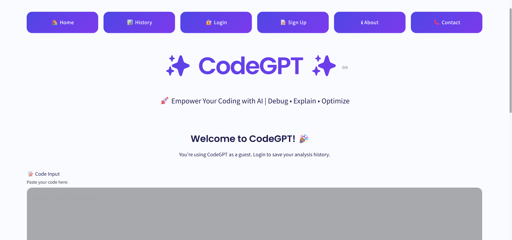

# CodeGPT 🤖
An intelligent AI-powered coding assistant that helps developers write better code with advanced features like bug detection, code explanation, optimization, and multi-language support.


## 🚀 Live Demo
Experience CodeGPT in action 👉 [CodeGPT](https://codegpt31.streamlit.app/)


## 🚀 Features

- **🔍 Bug Detection & Fixes**: Automatically identify and suggest fixes for common coding errors
- **📖 Code Explanation**: Get detailed explanations of complex code snippets in plain English
- **⚡ Code Optimization**: Improve code performance and readability with AI-powered suggestions
- **🌐 Multi-Language Support**: Seamlessly work with Java, C, C++, JavaScript, Python, and more
- **📷 Handwritten Code Recognition**: Upload images of handwritten code and get digitized, clean code output
- **🔄 Language Translation**: Convert code between different programming languages
- **💡 Smart Analysis**: Automatic language detection and context-aware suggestions
- 🔐 **Authentication System**
  - Secure user sign-up with OTP email verification.
  - Password-protected login.
  - User history tracking based on date and time (only for authenticated users).
- 🗂️ **User History** — Logged-in users can view their previously generated code and outputs.

  

## 🛠️ Tech Stack

- **Frontend & Backend**: Streamlit (Python)
- **Database**: sqlite3
- **AI Model**: Google Gemini 1.5 Flash
- **Deployment**: Streamlit Cloud

  

## 📁 Project Structure

```
CodeGPT/
├── app.py              # Main Streamlit application
├── requirements.txt    # Python dependencies
├── .env.template      # Environment variables template
└── README.md          # Project documentation
```

## Our Homepage Demo



## 🌐 Deployment

- The app is deployed using Streamlit Cloud Community.
- Accessible at : [https://codegpt31.streamlit.app/](https://codegpt31.streamlit.app/)

  

## ⚙️ Setup Instructions

### Prerequisites

- Python 3.8 or higher
- Google Gemini API key

### ⚙️ Setup Instructions/Local Installation

Follow the steps below to set up and run CodeGPT locally:

**1️⃣ Clone the repository**
   ```bash
   git clone https://github.com/yourusername/codegpt.git
   cd codegpt
   ```

**2️⃣ Create Virtual Environment (Optional but Recommended)**
  ``` bash
  python -m venv venv
  source venv/bin/activate  # On mac/linux
  venv\Scripts\activate     # On Windows
  ```

**3️⃣ Install dependencies**
   ```bash
   pip install -r requirements.txt
   ```
**4️⃣ Set up environment variables**
   ```bash
   cp .env.template .env
   ```
   Edit the `.env` file and add your Google Gemini API key:
   ```
   GEMINI_API_KEY=your_api_key_here
   ```
**5️⃣ Run the application**
   ```bash
   streamlit run app.py
   ```
**6️⃣ Open your browser**
   Navigate to `http://localhost:8501` to use CodeGPT locally.

   

### Getting Google Gemini API Key

1. Visit [Google AI Studio](https://makersuite.google.com/app/apikey)
2. Sign in with your Google account
3. Create a new API key
4. Copy the API key to your `.env` file

   

## 💻 Usage

1. **Select a Feature**: Choose from bug detection, code explanation, optimization, or language translation
2. **Input Your Code**: Paste or type your code in the provided text area
3. **Get AI Insights**: Click analyze to receive intelligent suggestions and improvements
4. **Apply Changes**: Use the AI-generated suggestions to enhance your code

   

## 🤝 Contributing

Contributions are welcome! Please feel free to submit a Pull Request. For major changes, please open an issue first to discuss what you would like to change.

1. Fork the Project
2. Create your Feature Branch (`git checkout -b feature/AmazingFeature`)
3. Commit your Changes (`git commit -m 'Add some AmazingFeature'`)
4. Push to the Branch (`git push origin feature/AmazingFeature`)
5. Open a Pull Request
   


## 🙏 Acknowledgments

- Google Gemini for providing the powerful AI model
- Streamlit for the excellent web framework
- The open-source community for inspiration and support

  

## 📧 Contact

For questions or suggestions, feel free to reach out

- Email : [ramakrishnasankavaram436@gmail.com](ramakrishnasankavaram436@gmail.com)
- Linkedin : [Sankavaram Rama Krishna](https://www.linkedin.com/in/sankavaram-rama-krishna-bb93aa254/)
- GitHub : [ramakrishnasankavaram](https://github.com/ramakrishnasankavaram)


---

**Built with ❤️ using AI and modern web technologies**
